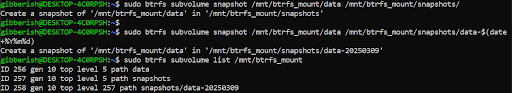

+++
title = "The Challenges of BTRFS implementation and getting persistent memory"  
[extra]  
bio = "The expectation of this project and the result of this project differ quite a lot from each other, that being said we hope you still enjoy this discussion and learn something new from it."
[[extra.authors]]  
name = "Benjamin Knutson"  
[[extra.authors]]  
name = "Shuyi Zheng"  
+++

## Introduction  
This project focused on exploring the benefits and challenges of the BTRFS file system and how it relates to persistent memory. BTRFS is a Merkle-Tree or B-Tree file system designed with CoW in mind. BTRFS is a type of harddrive type or file structure type characterized by its support of snapshotting and its built-in CoW functions. BTRFS dynamically organizes its data dynamically unlike other file systems that use bitmaps and inode tables. BTRFS also includes failsafes like checksums to recover metadata of files in the case that data gets corrupted.

## Table of Contents  
BTRFS - binary-tree file system. A file system that has properties including COW (copy on Writing) and snapshot.  
Persistent memory - A new type of memory device that has high performance and is byte-addressable.  
CoW - Copy on Write  
PMEM - Persistent Memory

## Implementation:  
To start it will be assumed that you are installing this filesystem on ubuntu 22.04 through WSL2

Figure 1: Setting up a 5GB Disk

You can use a command like `sudo mount -o loop,subvol=data btrfs-test.img /mnt/btrfs_test` to mount your test image you created. My test image is `btrfs-test.img` and im mounting `/mnt/btrfs_test`

Figure 2: checking that our drive is type btrfs

Figure 3: creating a sub volume

Figure 4: create a snapshot of a subdirectory

Example initialization of a BTRFS drive:

Create a virtual image  
`dd if=/dev/zero of=btrfs-test.img bs=1M count=1024`  
Format the system   
`mkfs.btrfs btrfs-test.img`
Create a mount  
`mkdir -p /mnt/btrfs_test`
Set the mount  
`sudo mount -o loop btrfs-test.img /mnt/btrfs_test`
Confirm with: `df -Th | grep btrfs`  
Create subvolume  
`sudo btrfs subvolume create /mnt/btrfs_test/data`

## Persistent memory   
What is persistent memory?   Persistent memory is a newish type of memory that
serves as a sudo hard disk but in the form of ram. Officially it’s a solid
state high performance byte addressable memory device that resides on the
memory bus of a system, but in layman's terms it simply stores memory in a non
volatile manner unlike your typical DRAM. This means that it essentially
combines the properties of DRAM and an SSD which gives several advantages like
quicker memory accesses than SSD’s and byte addressable storage.

BTRFS can be used on persistent memory computers, however btrfs is designed
with block devices in mind meaning that for a non block device like PMEM a new
file system would need to be developed for btrfs which would be possible thanks
to PMEMs byte-addressability. BPFS comes to mind as an example of such
a project, although they created a new system rather than adapting btrfs. 

##Tests  
Our tests focused on the snapshot capabilities of the btrfs file system to get
a better understanding of their capabilities and their applications. Due to
poor planning we were not able to get access to a computer with persistent
memory so we will instead be showing several tests performed on a standard
BTRFS file system using very normal specs (Intel I7-5500U, 8gb DDR4 RAM). The
environment for this experiment was WSL2 running ubuntu 24.04

1. snapshots frequency vs time to take a snapshot  
2. snapshot with vs without noisy programs  
3. snapshot performance over slow change of file

BTRFS noise experiment

## Results

Figure 6: Random data change plot

Figure 7: Frequency of snapshots vs time

Figure 8: Snapshotting with and without background processes

Looking at our results we see what we are expecting to see, as we increase our
workload we see a decrease in snapshotting speed. Snapshots of bigger files
take longer, although this is not really visible on the data change graph that
we provided since the range of snapshots did not include large enough sizes.
Snapshots of smaller files (5 GB or lower)

## Challenges 

We faced many challenges trying to study this file system and work with it, as
it turns out however our greatest challenge was finding a machine with
persistent memory hardware. We could have used Amazon web services however we
did not register for them quickly enough so it became unrealistic to work with
them. We were also not able to find a computer lab on campus with an available
persistent memory computer, therefore we were left with testing BTRFS on
a standard computer running a VM.   Both of us were not knowledgeable in
regards to BTRFS really so getting familiar with navigating all the commands
needed for this project was a far greater undertaking than we understood at
first. We also needed help with designing the tests for the file system and we
needed to ask for advice from our professor multiple times. The only other
major setbacks that challenged us was that our testing environment would crash
occasionally causing tasks to take longer than needed. 

## References  

- Blog about BTRFS and WSL2([https://blog.bryanroessler.com/2020-12-14-btrfs-on-wsl2/#:\~:text=Since%20BTRFS%20is%20baked%20into,is%20still%20a%20preview%20build](https://blog.bryanroessler.com/2020-12-14-btrfs-on-wsl2/#:~:text=Since%20BTRFS%20is%20baked%20into,is%20still%20a%20preview%20build). )  
- Reading on BPFS a file system developed for persistent memory([https://dl.acm.org/doi/abs/10.1145/1629575.1629589](https://dl.acm.org/doi/abs/10.1145/1629575.1629589) )  
- BTRFS wikipedia for initial understanding and reference search([https://en.wikipedia.org/wiki/Btrfs](https://en.wikipedia.org/wiki/Btrfs) )   
- BTRFS commands website([https://docs.oracle.com/en/operating-systems/oracle-linux/6/admin/ol_use_case3_btrfs.html](https://docs.oracle.com/en/operating-systems/oracle-linux/6/admin/ol_use_case3_btrfs.html) )  
- BTRFS Blog with useful pictures([https://recoverit.wondershare.com/file-system/what-is-btrfs-file-system.html](https://recoverit.wondershare.com/file-system/what-is-btrfs-file-system.html) )

Closes #25

